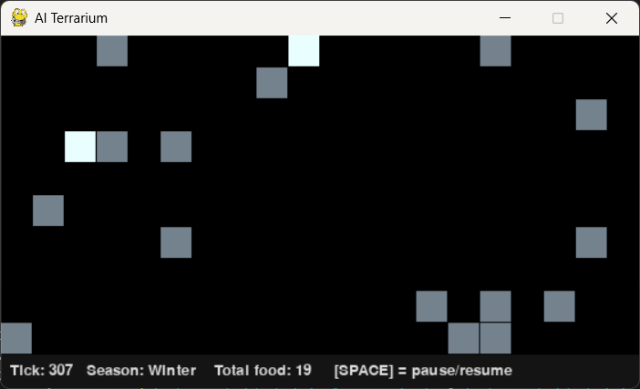
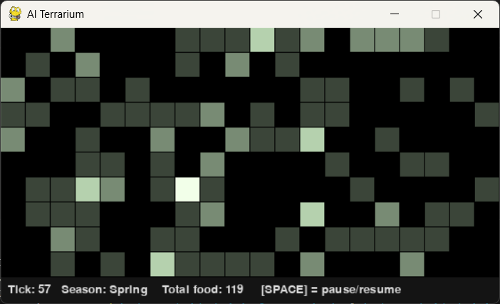

# Digital-Terrarium
A simple Python world simulation for a digital terrarium concept, originally intended to run alongside a Raspberry Pi digital frame project.
It includes a visual simulation, food growth and decay systems, seasonal changes, and live world statistics.

This was built as a personal project to explore systems thinking and simulation design. While the Raspberry Pi was ultimately used for a different project, this served as a beneficial introduction to the Python language and basic simulation architecture.

## Download
- window pygame : [(link Here)](https://github.com/klimtafwol/Digital-Terrarium/tree/main/Digital-Terrarium_v1.0)

## Features
- Dynamic food growth that updates every tick
- Time-based decay system
- Seasonal changes that affect growth rates
- Visual color shifts to reinforce seasonal feel
- HUD displaying current tick, season, and total food

## How to Run
1) Install dependencies:
```bash
pip install -r requirements.txt
```
2) Run the Simulation
```bash
python main_pygame.py
```

## what I built/ skills demonstrated
- Python scripting (basic syntax, logic, and structure)
- Visual rendering using pygame (with outside references)
- Renderer architecture and fixed-timestep simulation loop
- Systems thinking and simulation flow
- Visual design and balance (color, readability, atmosphere)

- ## Tech
- Pygame
- Language: Python
- platform: Windows
- (Designed with Raspberry-Pi in mind)

- ## Screenshots



  

## If I Continued This Project, I Would:
- Add a fauna or agent-based tile system
- Rework decay to be less directly time-dependent
- Introduce stronger visual variation for a more engaging digital terrarium display
  
